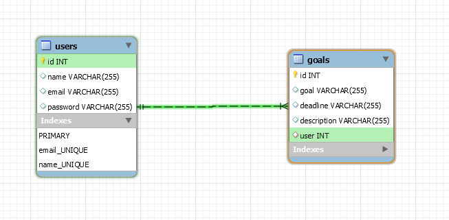
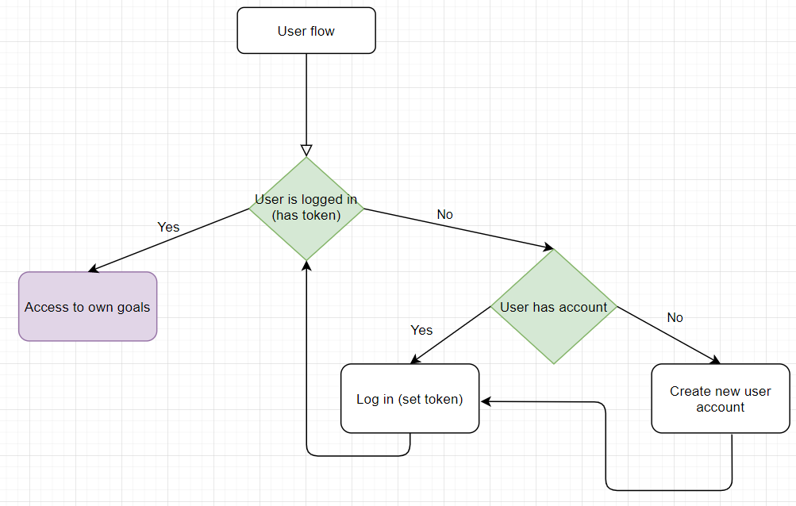
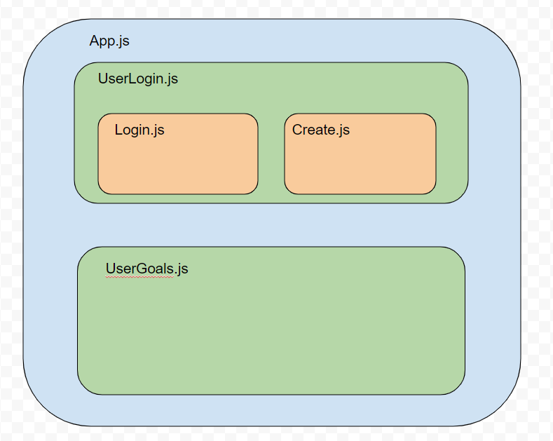

# aimily

## **Aimily**

### An app for setting goals and making sure you achieve them

#### Feature extension changes

Added user login and user creation components using jwt and bcrypt libraries

<https://docs.google.com/presentation/d/1zQW1SU4VAWtGLtWm4snRkQo04rCd5nyvwpyUXWtsU-0/edit?usp=sharing>

#### Database schema

##### DB dump /model/aimily_tables_v2.sql

#### Routes

#### Authentication user flow

#### React Component structure

_Very excited!_
:smile:

_This is a student project that was created at [CodeOp](http://codeop.tech), a full stack development bootcamp in Barcelona._
