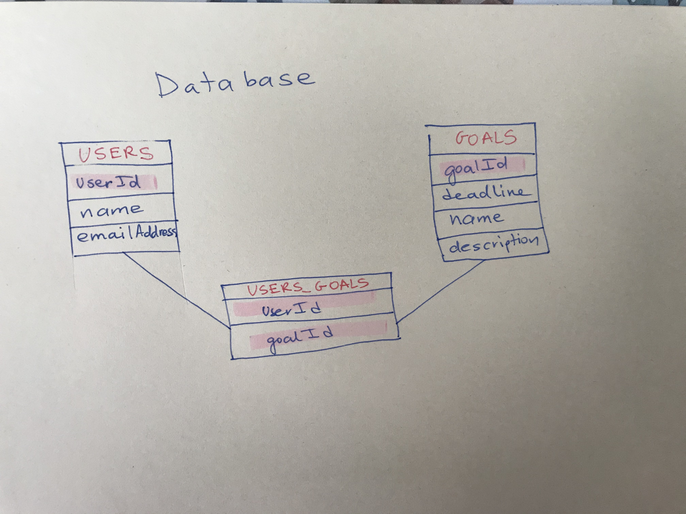
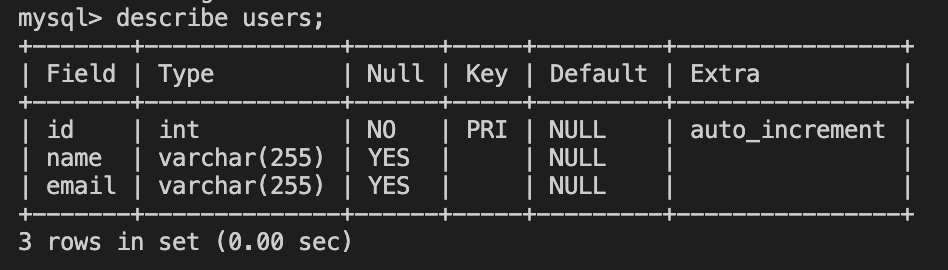
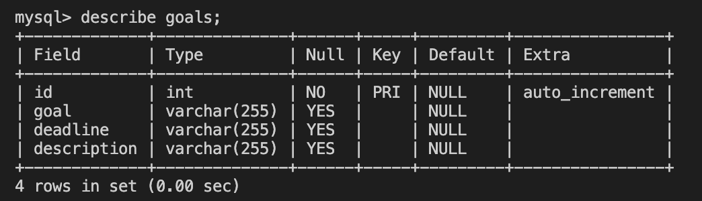
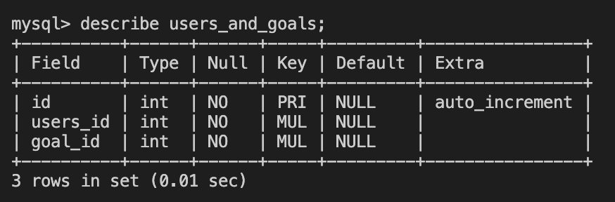

# aimily

## **Aimily**

### An app for setting goals and making sure you achieve them

#### Database schema

##### You will need to create 3 tables, the instructions are inside aimily_tables.sql

##### 1. "users" table it stores user's name and email and automatically adds an ID

##### 2. "goals" table, it stores the following infomration: goal, deadline, description and the same way adds an ID automatically

##### 3. the last table connects the first two, "users_and_goals", data is being added to this one at the same time as it is added to the first two

#### Routes

##### Please check routes/users.js for the backend routes, there are only POST and GET methods since I didn't need others for now

#### User flow

##### The users incerts their name and email, presses "next" button and ideally it should lead to the next page (but I didn't have time to create componets and couldn't figure out how to do it with CSS) and there the user inputs information about their goal. Once they click "Let's get started" button, the final screen appears - telling them what their goal is and by when they want to acieve it. One of the features you can try to add is show the user not only the last goal, but also their previous goals. If you want, you can separate 3 screens into 3 components, I started "Step 1" for the first screen but didn't get to finish it

_Very excited!_
:smile:

_This is a student project that was created at [CodeOp](http://codeop.tech), a full stack development bootcamp in Barcelona._
