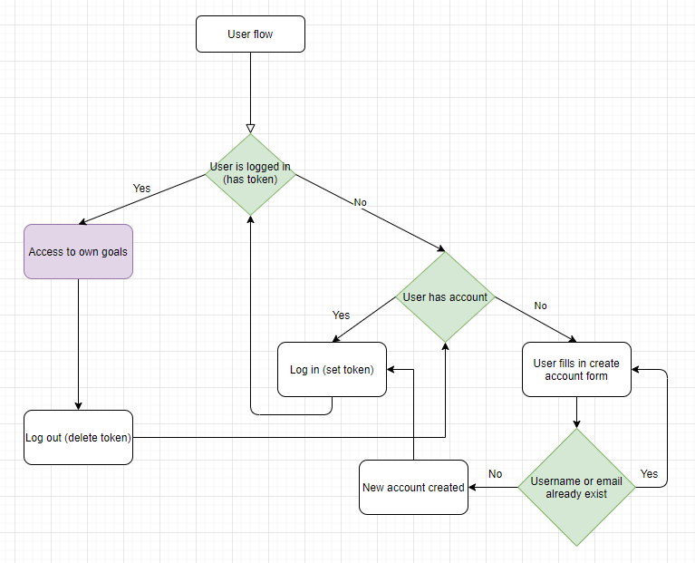

# aimily

## **Aimily**

### An app for setting goals and making sure you achieve them

#### Database schema

##### DB dump is /model/aimily_tables_v2.sql

#### Routes

Add new pic

#### User flow

#### Authentication user flow

#####

_Very excited!_
:smile:

_This is a student project that was created at [CodeOp](http://codeop.tech), a full stack development bootcamp in Barcelona._
